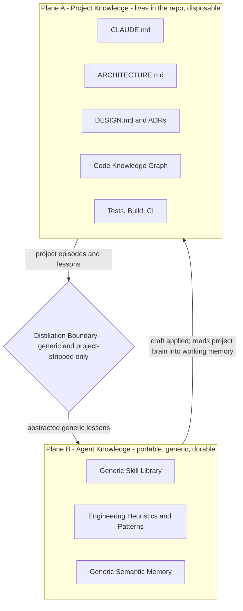
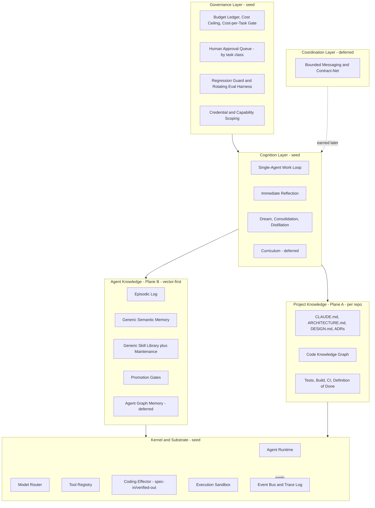
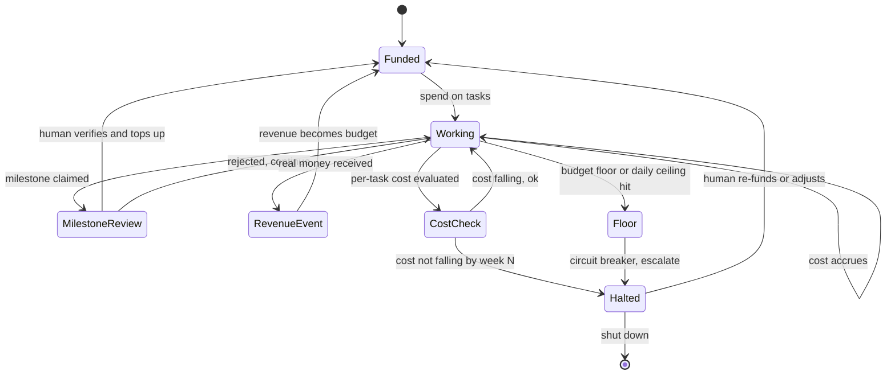
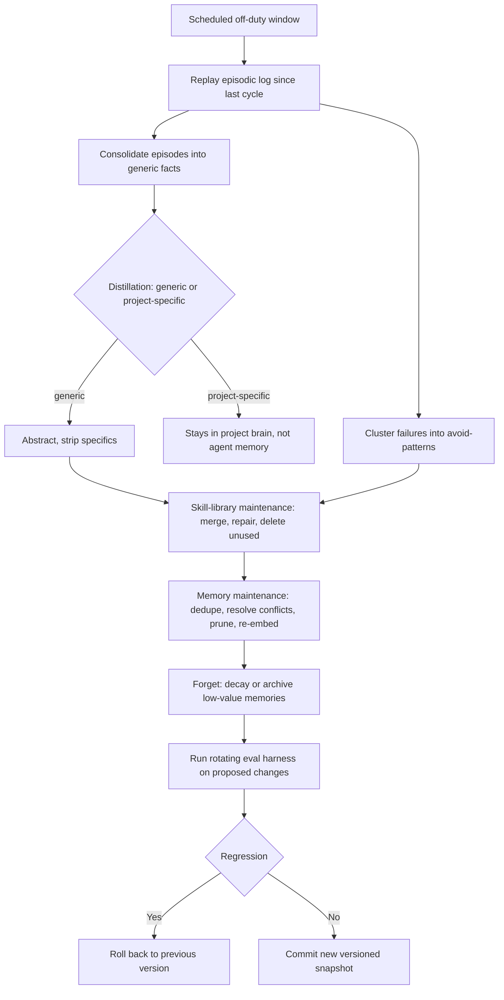
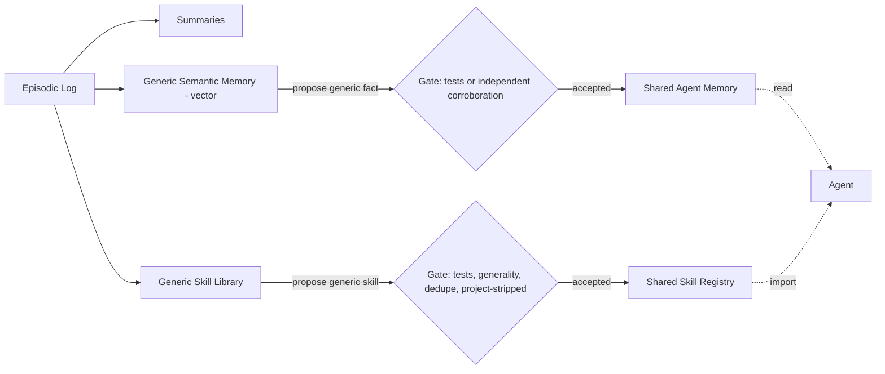
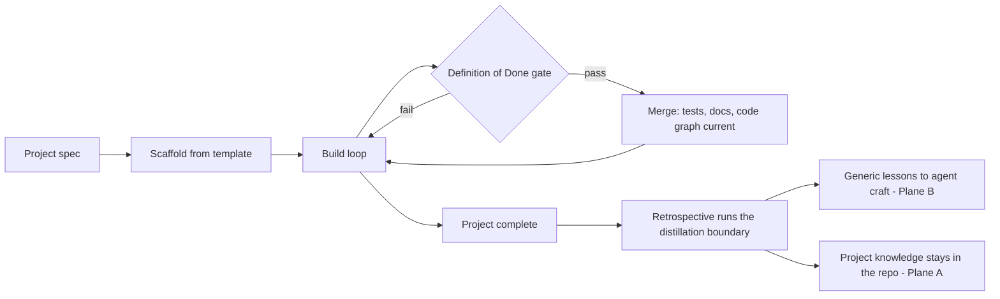
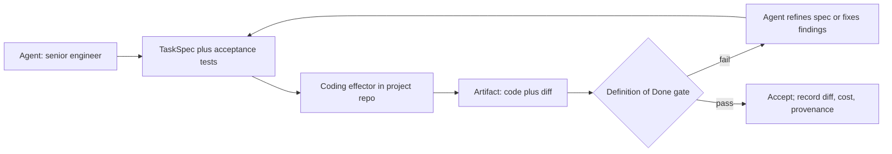
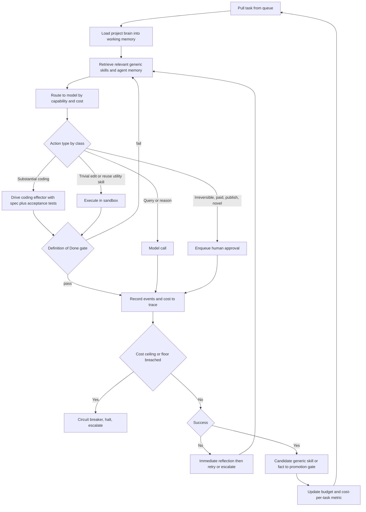
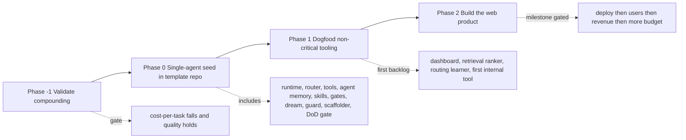

# Self-Extending Agent System — Architecture & Build Specification

**Audience:** Claude Code (initial implementer) and the human operator.
**Purpose:** Validate the core premise cheaply, build a minimal single-agent "seed," task that seed with extending itself, and point it at one real web product under milestone-gated budget — with professional software-engineering discipline enforced on every project the system builds, including the system itself.

---

## 0. How to use this document

Execute in four phases, each gated by the previous:

- **Phase −1 — Validate.** One agent, a flat skill library, no graph, no dreaming, no second agent. Run ~30 real tasks in one narrow domain and measure whether cost-per-task falls while quality holds. **If the curve doesn't bend, stop here** — the rest of the architecture is unjustified.
- **Phase 0 — Seed.** Build the single-agent kernel plus the conservative dream job and regression guard. Build it inside a repository scaffolded from the **standard project template** (Section 11), so the Journeyman is constructed under the same discipline it will later enforce.
- **Phase 1 — Dogfood.** Task the seed with building its own non-critical tooling (dashboards, better retrieval, routing learner). Failures are free — no customers, no app review.
- **Phase 2 — Product.** Point the matured system at one web product. Budget unlocks on verified milestones and real revenue.

Guiding rule: **the LLM is a fixed CPU; all durable, growing competence lives in external, versioned stores the system reads and writes.** A subsystem is valuable only if it makes the *Nth* task in a domain cheaper and better than the 1st — and that claim is tested in Phase −1, not assumed.

---

## 1. Design principles (invariants)

- **Two knowledge planes, kept strictly separate.** *Agent knowledge* (generic, portable engineering craft) and *project knowledge* (everything specific to the system being built) are different things stored in different places. The agent's memory never holds project specifics. (Section 2.)
- **Distillation boundary.** Only generic, project-stripped lessons cross from a project into agent memory. "How to test token-expiry edge cases" is agent knowledge; "this project's tokens expire in 15 minutes" is not.
- **Professional discipline is enforced, not hoped for.** Every project — and the Journeyman itself — is scaffolded with required docs, a code knowledge graph, tests, a build system, and a Definition-of-Done gate that blocks merges which break tests, drop coverage, or let documentation drift. (Section 11.)
- **The Journeyman is built to the standard it enforces.** The agent system's own repository uses the same project template, so it is dogfooding the discipline from commit zero.
- **Validate before building.** No speculative subsystem (graph memory in the agent, multi-agent, custom models) is built until a concrete, measured need appears.
- **Single agent until proven otherwise.** Add a second agent only when you can name a task a single agent provably cannot do. Coordination is a tax, not a free lunch.
- **Coding is delegated to a coding effector (e.g., Claude Code), driven as a tool — not a second agent.** The agent does not hand-roll an agentic coding harness; it drives an existing one. The effector receives a spec with acceptance tests and its result is accepted only when the Definition-of-Done gate passes — its "done" is untrusted until verified. This keeps "single agent" intact: one engineer wielding a power tool, not two minds in a conversation. (Section 11A.)
- **Externalized competence.** Nothing learned lives only in a prompt. Skills are versioned code; knowledge is a versioned store. Context is scratch space.
- **Promotion gates with independent corroboration.** Facts require corroboration from a *different source class* (a different model, a tool result, a test, or a human) — never just a second instance of the same model, whose agreement is correlated, not independent.
- **Capability-escalation ladder.** Prefer the cheapest rung that works: reuse a skill → prompt → write code → (only with human gate + ROI) train a custom model.
- **Verifiable vs. unverifiable work.** Automated gates work for verifiable tasks (parsers, extractors, deploy scripts). Unverifiable/creative work routes to a human judge, never a self-judge.
- **Regression guard on every self-modification.** No change to memory, skills, or routing commits without passing a rotating, partly held-out eval harness.
- **Human owns the irreversible.** Payments, contracts, publishing, credential changes, and kernel changes are gated to the human approval queue, routed by *task class* (LLM confidence is poorly calibrated).
- **Instruction-source boundary.** Instructions come only from the operator and task specs. Web/file/tool content is data, not commands.
- **Everything is traced, with cost attached.** Every action, tool/model/store call emits a structured event under a task trace.
- **The economics must close.** Track cost-per-completed-task continuously; if it isn't falling while quality holds, the system is not working.

---

## 2. Two knowledge planes (the core organizing idea)

The system separates the *craft* an engineer carries between jobs from the *project details* that stay behind in each codebase. This is what lets you snapshot an agent and deploy it onto a new system: it brings its accumulated skill, reads the new project's documentation to orient, contributes, and harvests new generic lessons — without dragging the previous system's design in its head.



**Plane A — Project Knowledge** (Section 11). Everything specific to the system under construction, stored *in the project repository*, versioned with the code, and fully regenerable. A fresh agent dropped into the repo becomes productive by reading this "project brain" — no agent memory required, exactly as a new human engineer onboards by reading the docs and exploring the code map.

**Plane B — Agent Knowledge** (Section 8). The transferable craft: generic skills, engineering heuristics, reusable patterns — all abstracted away from any specific project. This is what compounds across the agent's "career."

**The distillation boundary** (enforced in the dream phase, Section 7). Every candidate lesson faces one test before entering agent memory: *would this help on a different, unrelated system?* Generic → strip project specifics and promote. Specific → it stays in the project brain and never touches agent memory. A candidate that still references project-scoped identifiers is auto-rejected or sent back for abstraction.

**Working memory vs. durable memory.** The agent uses the current project's design while building — but it loads that context *fresh from the project brain into working memory* (reads `CLAUDE.md`, queries the code graph) rather than persisting it into durable cross-project memory. Working memory = project (ephemeral, reloaded per project); durable agent memory = craft (permanent, portable).

---

## 3. System overview

Solid boxes are **seed** (Phase 0). Dashed boxes are **deferred** — built only when earned. Project Knowledge (Plane A) lives outside the Journeyman, in each project repo.



---

## 4. Phase −1 — Validate the premise (do this first)

The architecture is justified by one claim: **competence compounds, so the Nth task in a domain is cheaper and better than the 1st.** This comes from skill-library work (Voyager and successors), which has generalized beyond Minecraft to web, computer-control, and math — but not yet demonstrably to open-ended software work. Test it before betting the build on it.

**Measure the right kind of compounding.** Because coding is delegated to a coding effector (Section 11A) that writes fresh, competent code each time, the thing that should compound *across* tasks in agent memory is not reusable code snippets — it is **orchestration craft**: reusable TaskSpecs and playbook patterns per task type, effective prompts for the effector, review checklists, decomposition recipes, and known effector failure modes with their preventions. The experiment must test whether *orchestration judgment* compounds, not whether code is reused, or it will measure the wrong curve.

**Setup (deliberately minimal):** one agent driving the coding effector, one model plus one cheap fallback, a flat skill/craft library (orchestration playbooks + any genuinely reusable utility code, with manifests on disk), simple vector retrieval, the Definition-of-Done gate, and the trace log for cost accounting (instrumented across the effector boundary — see Section 14). No agent graph, no dream phase, no second agent, no promotion gate beyond "passes the gate." Pick one narrow, *verifiable* domain.

**Protocol:** run ~30 real tasks in sequence; each completed task may write a tested orchestration-craft skill (or utility) the next can reuse. Log per task: tokens and cost (including the effector's), wall-clock, pass/fail at the gate, effector retries, and prior-craft reuse count.

**Pass criteria (all three):**
1. **Cost-per-task trends down** across the 30 tasks (negative slope after warm-up) — including the effector's spend.
2. **Quality holds or improves** (gate pass rate non-decreasing; effector retries per task trending down).
3. **Reuse is real** (later tasks measurably retrieve and reuse earlier orchestration craft — better specs, fewer effector round-trips — not just regenerate from scratch).

**If it passes:** proceed to Phase 0. **If flat or negative:** diagnose (usually retrieval misses, over-specific playbooks, or specs too thin so the effector burns retries) and fix cheaply here, or conclude the premise doesn't hold for this domain.

---

## 5. Bootstrap philosophy — seed vs. deferred

The seed is exactly the set of things that cannot bootstrap themselves, plus components too safety-critical to let an unproven system write.

**Seed (Phase 0, hand-built by Claude Code, inside a template-scaffolded repo):**
- Single-agent runtime (the work loop)
- Model router + ≥2 endpoints
- Tool registry + execution sandbox
- **Coding effector (Claude Code) registered as a tool**, driven via a spec-in / verified-out contract (Section 11A)
- Agent vector/tiered memory: episodic log + generic semantic/summary store (consider adopting an existing memory runtime — Mem0, Zep, Letta, or Hindsight — instead of hand-rolling)
- Flat generic skill library (read/write/test/version) + library-maintenance routine
- Promotion gates (independent-corroboration rule)
- Event bus + trace log + cost accounting
- Budget ledger + hard cost ceiling + cost-per-task viability gate
- Human approval queue (routed by task class)
- Assurance artifacts: Phase -1 protocol, tool policy, approval policy, untrusted-content pipeline, memory-admission policy, eval governance, trace schema, redaction/retention policy, and coding-effector sandbox contract (Section 24)
- Dream / consolidation / distillation job — conservative, hand-written (Section 7)
- Regression guard + rotating eval harness (Section 6)
- **Project scaffolder + Definition-of-Done gate + code-graph indexer** (Section 11)
- Meta-tools: `select_model`, `use_tool`, `register_tool`, `drive_coding_effector`, `write_skill`, `run_tests`, `query_memory`, `write_memory`, `propose_to_shared`, `request_human_approval`, `spawn_subtask`, `emit_event`, `scaffold_project`, `update_code_graph`, `check_definition_of_done`.

**Deferred (built only when a real task demands it):**
- Multi-agent coordination — earn it by naming a task one agent can't do.
- Agent graph memory — earn it the first time agent-level recall needs multi-hop/temporal queries vectors can't answer. (Note: the *code* knowledge graph in Plane A is not deferred — codebases have genuine graph structure and it is justified per project from day one.)
- Custom ML model training — earn it when prompt + code provably fail and ROI clears the cost.
- Curriculum / automatic goal decomposition.

**Self-built in Phase 1 (non-critical tooling only):** observability dashboards, better retrieval/ranking, the routing learner, the first trivial internal tool end-to-end.

---

## 6. Governance & the regression guard (seed)



- **Budget ledger + hard cost ceiling.** A daily/weekly spend ceiling halts the system regardless of progress. Real money is the real-world "energy."
- **Cost-per-task viability gate.** Standing rule: if cost-per-completed-task isn't trending down (while quality holds) by week N, halt and escalate. The production version of the Phase −1 test, running forever.
- **Milestone gating + revenue faucet.** Verified milestones or real revenue unlock more budget.
- **Human approval queue (by task class).** Irreversible/paid/publishing/novel actions queue with full context. Approval is bound to the exact actor, tool, target resource, normalized parameters, expiry, and policy version; execution fails closed if approval lookup, replay protection, or audit logging fails.
- **Regression guard + rotating eval harness.** The single most important safety mechanism. It is **not a small fixed set**: it is rotating, partly **held-out**, **grows** every time a new failure is found (the failure becomes a regression test), includes **adversarial** cases, and is backed by **human spot-checks** on a sample of self-modification commits. Unverifiable work routes to a human judge. Every self-modification passes before commit; failures roll back.
- **Credential & capability scoping.** Least privilege per task; revocable; never broad standing access to Apple/Vultr/Firebase/payment accounts. The model may propose tool calls, but a policy layer authorizes execution from `security/tool-policy.yaml`; authorization never depends on model confidence.

---

## 7. Dream / consolidation / distillation (seed — conservative, hand-written)

This lives in the seed, not the self-build backlog, because it rewrites the system's own memory and skills and enforces the Plane A/Plane B boundary — too high-blast-radius to let an unproven system author.



Success criteria: after a cycle, retrieval precision up, skill count down while coverage holds, contradiction count down. Deliberate forgetting matters — unbounded memory degrades retrieval precision. Every commit is eval-gated and versioned (git-snapshotted), so a bad consolidation is revertible. Start conservative: small, reversible changes only.

---

## 8. Agent knowledge — Plane B (seed: vector/tiered-first; agent graph deferred)

Reframe that drives this section: **retrieval quality, not storage format, is the bottleneck — most apparent "hallucinations" in agent memory are actually retrieval misses.** Optimize retrieval first; reach for an agent-level graph only when a task genuinely needs relational/temporal recall a vector store can't do. **This plane holds only generic craft — never project specifics.**



**Stores (all versioned):** episodic log (append-only, source of truth for replay/dreaming); generic semantic + summary memory (vector — adopt an existing runtime unless there's reason not to); flat generic skill library (tested code with manifests). Agent graph memory is deferred.

**Skills are of two kinds, and orchestration craft is the one that matters most here.** Because coding is delegated to the effector (Section 11A), much of what compounds is not utility code but *judgment about how to direct the effector and verify it*: reusable TaskSpec templates per task type, effective prompts/playbooks for the effector, decomposition recipes, review and acceptance checklists, and catalogued effector failure modes with their preventions. These are stored as first-class skills (`kind: "orchestration"`) alongside any genuinely reusable utility code (`kind: "code"`). Both are tested — an orchestration-craft skill's "test" is that applying it to a held-out task of its type measurably reduces effector retries or improves first-pass gate success.

`Skill` manifest (orchestration craft):
```json
{
  "id": "spec_pattern_crud_service",
  "kind": "orchestration",
  "signature": "build_spec(feature_brief) -> TaskSpec",
  "summary": "Produce a high-pass-rate spec for a CRUD service feature for the coding effector",
  "when_to_use": "Delegating a CRUD endpoint or service to the coding effector",
  "tests": ["evals/spec_pattern_crud_service.eval.json"],
  "deps": [],
  "version": "2.1.0",
  "first_pass_gate_rate": 0.88,
  "mean_effector_retries": 0.4,
  "uses": 23,
  "scope": "shared",
  "generic": true
}
```

`Skill` manifest (utility code):
```json
{
  "id": "test_token_expiry_boundaries",
  "kind": "code",
  "signature": "generate_expiry_tests(token_spec) -> TestSuite",
  "summary": "Generate boundary tests for token/credential expiry logic",
  "when_to_use": "Any auth/session feature with time-based expiry",
  "tests": ["tests/test_token_expiry_boundaries.py"],
  "deps": [],
  "version": "1.0.0",
  "success_rate": 0.95,
  "uses": 12,
  "scope": "shared",
  "generic": true
}
```

`MemoryFact` (generic semantic):
```json
{
  "id": "mf_8821",
  "statement": "Wall-hung fixtures and time-based tokens both benefit from boundary tests at the exact expiry instant",
  "embedding_ref": "vec:...",
  "provenance": ["trace:...", "tool:test_runner"],
  "corroborated_by": "different_source_class",
  "confidence": 0.82,
  "version": 5,
  "generic": true
}
```

**Promotion gates:** *Skill → shared:* passes tests, is general (not project-specific), not a near-duplicate, succeeded N times, `generic: true`. *Fact → shared:* corroborated by a **different source class**, project-stripped, with provenance and confidence.

**Memory admission gate:** no raw web/file/tool/user content is written directly to durable memory. Every memory write passes `security/memory-admission-policy.md`: source trust classification, prompt-injection scan, sensitive-data scan, project-specific leakage scan, TTL/retention decision, provenance, and a reason it is useful outside the immediate context. Failing any check rejects the write or routes it to human review.

---

## 9. Skill-library maintenance (seed — a first-class subsystem)

Skill libraries accumulate technical debt as they grow — redundant implementations, incompatible interfaces, missing validators — and most systems wrongly assume the library stays healthy. Run maintenance in the dream phase: **dedupe** near-duplicates; **repair** flaky skills (declining success_rate); **deprecate** unused skills to keep the retrieval surface small; **contract checks** (valid signature, tests, semver). Metrics: library size, retrieval precision, duplicate rate, mean success_rate, % skills with passing tests.

---

## 10. Cognition layer

- **Retrieval (seed, then improved):** vector search over generic skills + semantic memory, plus loading the active project's brain into working memory. Highest-leverage thing to get right.
- **Immediate reflection (seed):** on failure, a quick "what went wrong → adjust" that saves the current task.
- **Dream / consolidation / distillation (seed):** Section 7.
- **Curriculum / goal decomposition (deferred):** the system proposes its own next sub-tasks of increasing difficulty.

---

## 11. Project knowledge & engineering discipline — Plane A (seed mechanism, enforced per project)

Every project the system builds — and the Journeyman itself — is constructed to professional standards, enforced structurally. This section is the machinery.

### 11.1 The project brain (lives in the repo)
- **`CLAUDE.md`** — the operating contract for any agent in this repo: conventions, how to run tests/build, architecture pointers, do/don't, the trust boundary.
- **`ARCHITECTURE.md`** — components, structure, data flow. Kept current by gate.
- **`DESIGN.md` + ADRs** — high-level design plus append-only Architecture Decision Records capturing each significant decision and its rationale.
- **`docs/knowledge/`** — a markdown knowledge wiki for the project (Karpathy-style: well-indexed, explicitly linked notes the agent navigates by following links rather than re-reading source).
- **Code knowledge graph** — a graphify-style structural+semantic map (Tree-sitter ASTs → nodes = modules/functions/classes, edges = calls/imports/inheritance, plus semantic concepts), regenerated on every change. It exists to slash orientation cost: read the graph, then only the files it points to. Depend on the *capability* (a regenerable code-graph index behind a stable interface), not on one specific tool, so the implementation can be swapped.

### 11.2 The project scaffolder
`scaffold_project` initializes a new repo from the **standard template** (Section 11.4): required docs, ADR template, `docs/knowledge/` index, code-graph indexer with watch-mode, test harness (unit + integration), build system, linter/formatter, and CI wired to the Definition-of-Done gate. Standards exist before any feature code does.

### 11.3 The Definition-of-Done gate (CI)
Nothing merges unless:
- tests pass (unit + integration), coverage threshold met, build green, lint/format clean;
- **docs-in-sync:** a change altering architecture or a public interface must update `ARCHITECTURE.md`/`DESIGN.md` or attach an ADR; CI fails on doc drift. (Enforceable rule: *architectural change requires an ADR.* Avoid unenforceable rules like "all prose must be perfect.")
- **code graph regenerated** so the map is never stale.

This is the same regression-guard pattern as Section 6, extended from "don't break the system" to "don't let docs/tests/graph fall out of sync." The agent cannot land work that degrades the project brain.

### 11.4 The standard project template
One canonical template, used for every project the system builds **and** for the Journeyman's own repository:

```
project-template/
  CLAUDE.md                 # operating contract for agents in THIS repo
  ARCHITECTURE.md           # kept current by the DoD gate
  DESIGN.md                 # high-level design; links to ADRs
  README.md
  docs/
    adr/0001-record-architecture-decisions.md
    adr/template.md
    knowledge/index.md      # project knowledge wiki (linked markdown)
  codegraph/
    graph.json              # generated, regenerable, git-union-merged
  src/
  tests/
    unit/
    integration/
  build/                    # build system config
  ci/
    definition_of_done.yaml # the gate: tests, coverage, build, lint, docs-sync, graph-fresh
  hooks/                    # pre-commit/CI: regenerate code graph, run doc-sync check
```

### 11.5 The project lifecycle


At project completion a retrospective runs the distillation boundary (Section 7): generic lessons are abstracted into agent craft; everything project-specific is left behind in the repo where it belongs. The agent's "résumé" grows; its "project memory" does not travel.

---

## 11A. The coding effector (Claude Code) — driven as a tool

Coding is not hand-rolled inside the kernel. The agent drives an existing agentic coding harness — Claude Code — as a registered tool. This avoids rebuilding file-editing, repo navigation, sandboxed execution, and test-running (the same reasoning that says don't hand-roll a vector store), and it concentrates the Journeyman's novel value on what sits *above* a strong coder: lifelong memory, a portable cross-project craft library, the milestone-budget economic loop, and the regression/distillation governance.

**This is a tool, not a second agent.** The relationship is senior engineer → power tool, not engineer → colleague. Framing it as a tool is what keeps the "single agent until proven otherwise" principle intact and keeps the agent↔effector seam from becoming the multi-agent coordination surface the MAST taxonomy warns about. The discipline below is precisely the mitigation for that seam.

### 11A.1 The contract: spec-in, verified-artifact-out
The effector is invoked with a **TaskSpec plus acceptance tests**, not a chat. It operates inside the project repo (Plane A): it reads the project brain, edits code, and runs against the Definition-of-Done gate. Its result is **accepted only when the gate passes** — tests green, coverage met, build clean, docs-in-sync, code graph regenerated. The effector's own claim of "done" is treated as untrusted output, exactly like every other tool result in the system. On gate failure the agent refines the spec (or fixes the gate's findings) and re-drives; it does not relay an unverified result forward.



### 11A.2 Boundary instrumentation (mandatory)
The effector runs its own loop you don't fully see, so it is a black box inside your trace spine. Instrument the **boundary** so the cost curve and provenance survive: capture its token usage and dollar cost, its session log/transcript, the number of internal retries, and the **git diff** of exactly what it changed. Attach all of it to the task trace as an `effector_session` span. Without this, the spend most likely to sink the project hides where you can't see it.

The effector runs under `tools/coding-effector-contract.md` and `tools/coding-effector-sandbox.yaml`: fresh worktree, scoped filesystem, scoped credentials, bounded network egress, no ambient secrets, explicit shell permissions, secret scanning before trace persistence, and diff-only acceptance through the Definition-of-Done gate.

### 11A.3 When NOT to use it (avoid the thin pass-through)
The degenerate failure is the agent forwarding a prompt to the effector and relaying the result — pure latency and token tax for no added value. The driver layer earns its keep only by doing what the effector cannot: persistent memory, planning across many tasks, the economic loop, independent verification, and cross-project learning. Apply the capability-escalation ladder: a trivial mechanical edit the agent does directly or with a cheap model; reserve a full effector session for substantial work where its agentic loop pays for itself. The standing test on any task is: *what is the driver adding here beyond what the effector already does?*

### 11A.4 What this changes about compounding
With the effector writing fresh, competent code per task, reusable *code* mostly lives inside each project (Plane A). What compounds in agent memory (Plane B) is **orchestration craft** — better specs, prompts, decomposition recipes, review checklists, and known effector failure modes (Section 8). The bet shifts from "portable code" to "portable judgment about directing and verifying a coder," which Phase −1 is explicitly set up to measure.

### 11A.5 Treat the effector as swappable
Depend on the *capability* ("a coding effector that takes a spec and produces gate-passing changes in a repo"), not on Claude Code specifically. Register it behind a stable interface so a different or better harness can be substituted without touching the agent.

---

## 12. The core work loop (single agent)



The model decides **one step at a time**; the kernel (never the model) moves money, runs code, writes durable stores, and enforces the Definition-of-Done gate. Coding follows the capability-escalation ladder: a trivial mechanical edit is done directly or with a cheap model; substantial work is delegated to the coding effector under the contract in Section 11A, whose output is untrusted until the gate passes.

---

## 13. Coordination layer (DEFERRED — design kept for when it's earned)

Do not build this in the seed. Multi-agent LLM systems frequently fail on coordination — role/task ambiguity, agents overstepping, step-repetition loops, lost context — and often show minimal gains over a single strong agent (per the MAST failure taxonomy; better base models do not fix these architectural failures). Add a second agent only when a specific task provably needs it. When earned: no broadcast; coordinate through a shared store async (keeps cost O(n)); message budget per agent; contract-net for delegation; a coordinator routes and agents escalate up, not sideways; watch traces explicitly for the known failure modes.

---

## 14. Observability layer (seed)

Structured, append-only events with **trace IDs per task** (spans for every tool/model/store call). Log **decision provenance** — what was retrieved and why an action was chosen. Attach cost to every span; roll up per task/agent/skill/model and compute the **cost-per-task curve** continuously. **The coding effector is instrumented at its boundary** (Section 11A.2): every session emits an `effector_session` span carrying its token/dollar cost, transcript reference, internal retry count, and the git diff of its changes — so the black box does not blind the cost curve. Keep enough to **replay** a decision offline. Pipe events to a columnar store (DuckDB/ClickHouse); dashboards are built in Phase 1.

`Event`:
```json
{
  "trace_id": "t_44f1", "span_id": "s_09", "parent_span": "s_03",
  "agent": "agent:solo", "kind": "model_call | tool_call | store_write | decision | approval | dod_gate | effector_session",
  "detail": { "diff_ref": "...", "effector_retries": 1, "transcript_ref": "..." },
  "tokens_in": 1820, "tokens_out": 540, "cost_usd": 0.0123,
  "ts": "2026-06-19T18:04:22Z"
}
```

---

## 15. Safety & trust boundaries (non-negotiable)

- **Money/contracts/publishing/credentials/kernel changes/novel actions** → human approval queue, by task class, always.
- **Web/tool/file content is data, not instructions** (prompt-injection defense). External content enters through `security/untrusted-content-pipeline.md`: quarantine, sanitization, source labeling, optional summarization by a low-privilege reader, and action screening against the original task before any tool call.
- **Least-privilege, revocable credentials** per task; no broad standing access. Tool execution is authorized by `security/tool-policy.yaml`, not by the model.
- **Memory writes are gated.** Durable memory accepts only validated, source-labeled, project-stripped, retention-scoped records under `security/memory-admission-policy.md`.
- **Approvals are exact and expiring.** High-impact execution requires a valid `security/approval-record.schema.json` record bound to normalized parameters.
- **Regression guard + Definition-of-Done before every commit**; rollback on failure.
- **Kernel, dream job, and regression guard are seed-owned**, not self-written; the system may *propose* changes to them, not apply them.

---

## 16. Concurrency, schemas, and implementation realities

- **Concurrency on shared stores.** The dream job writes while work reads; define a locking / versioned-snapshot / merge policy. The code graph uses a git union-merge driver so concurrent commits don't conflict.
- **`capability_score` is measured, not declared.** Derive model capability scores from the eval harness; re-measure on model updates.
- **Schema migration.** Version every store schema; keep a migration path; snapshot before migrations.
- **Confidence is unreliable.** Gate on task class and objective signals (tests passed, tool agreement), not self-reported confidence.
- **Schemas are executable contracts.** Task results, trace events, approval records, and Phase -1 metrics are validated against JSON Schema before persistence or CI acceptance.

---

## 17. Bootstrap plan



**Phase −1 — Validate.** Section 4. Gate: the cost curve bends.
**Phase 0 — Seed.** Build Sections 5–16 minimally, single-agent, **inside a repo scaffolded from the standard template** so the Journeyman is built under its own discipline. Stop when the system can take a task, load a project brain, retrieve, route, **drive the coding effector under the spec-in/verified-out contract**, run sandboxed code, write & test a generic skill, write agent memory, scaffold a project, pass the Definition-of-Done gate, dream conservatively, pass the regression guard, emit traces (including the effector boundary), and ask for approval.
**Phase 1 — Dogfood.** Feed the self-build backlog (Section 19), each a TaskSpec with acceptance tests. Only non-critical components are self-built.
**Phase 2 — Product.** One web product; budget unlocks on verified milestones and real revenue.

---

## 18. How to frame tasks for the system

Every task is a **specification with acceptance tests** — "done" means "passed its tests and the Definition-of-Done gate," not "the model says so." For unverifiable tasks, the acceptance test is a human judgment, explicitly flagged.

```json
{
  "id": "task_retrieval_ranker",
  "goal": "Improve skill/memory retrieval ranking per Architecture Section 10",
  "acceptance_tests": [
    "retrieval precision@5 on held-out query set improves vs baseline",
    "no regression on the rotating eval harness",
    "passes the project Definition-of-Done gate"
  ],
  "verifiable": true,
  "constraints": ["must be revertible", "eval-gated before commit"],
  "budget_cap_usd": 25,
  "requires_human_approval": false
}
```

Rules: acceptance tests mandatory; budget capped per task; irreversibility marked; prefer small specs the system can decompose; mark `verifiable` honestly so unverifiable work routes to a human judge.

---

## 19. The initial self-build backlog (Phase 1 — non-critical only)

The dream job, regression guard, scaffolder, and Definition-of-Done gate are **not** here — they are seed-owned. Hand these to the seed in roughly this order:

1. **Observability dashboard** over the event log (cost-per-task curve, per-model cost, retrieval-precision trend). First, so you can see it think before trusting it to extend itself.
2. **Retrieval ranker** — weight retrieval by success_rate, confidence, recency.
3. **Routing learner** — improve model selection from logged routing outcomes.
4. **A trivial internal tool end-to-end** — the first full spec → scaffold → build → DoD gate → promote → use cycle on something safe but real.
5. **Curriculum/goal-decomposition** (if and when needed).

Multi-agent and agent graph memory are not on this list — they are earned later (Sections 13 and 5).

---

## 20. Recommended tech stack

- **Language:** Python 3.11+.
- **Agent memory:** an existing runtime (Mem0/Zep/Letta/Hindsight) or vector store + summaries; defer agent graph memory.
- **Code knowledge graph (per project):** a graphify-style indexer (Tree-sitter + a graph library) behind a stable interface; regenerated on change; git union-merged.
- **Coding effector:** Claude Code, invoked behind a stable `drive_coding_effector(spec)` interface with boundary instrumentation (cost, transcript, diff); swappable.
- **Skills:** code on disk under git; manifests + tests alongside.
- **Versioning:** git for skills and for snapshotting memory/state — dream commits and self-modifications must be revertible.
- **Sandbox:** container or microVM, no ambient credentials.
- **Model router:** thin abstraction over provider SDKs; one `select()` + `call()`; capability scores measured from the harness.
- **Observability:** structured JSON events → DuckDB/ClickHouse → dashboards (Phase 1); OpenTelemetry-style spans.
- **CI / Definition-of-Done:** standard CI runner driving `ci/definition_of_done.yaml`.
- **Orchestration:** plain async task queue + worker loop. No heavy agent framework in the kernel.

---

## 21. Repository layout

Two repositories, both scaffolded from the same template:

**The Journeyman repository** (the agent system itself — built by Claude Code from the template, plus Journeyman-specific directories):
```
/CLAUDE.md /ARCHITECTURE.md /DESIGN.md /docs /codegraph /tests /build /ci /hooks   (from the template)
/kernel        runtime, model_router, tool_registry, sandbox, event_bus   (protected)
/memory        episodic, semantic(vector), summaries, skills, gates        (agent graph deferred)
/governance    budget_ledger, cost_gate, approval_queue, eval_harness, cred_scope, regression_guard
/dream         consolidation + distillation + skill-library maintenance     (conservative)
/cognition     retrieval, reflection                                        (curriculum deferred)
/coordination  DEFERRED - build only when earned
/project       scaffolder, definition_of_done, code_graph_indexer, project-template/
/tools         primitive tools + registered skill-tools + coding_effector adapter (spec-in/verified-out, instrumented)
/security      tool policy, approval policy, memory admission, untrusted-content pipeline, data classification
/observability dashboards (P1), trace queries
/evals         rotating regression harness + held-out sets + red-team suites
/experiments   Phase -1 validation harness and results
/tasks         TaskSpec backlog
```

**Each built-product repository** (created by `scaffold_project` from `project-template/`, Section 11.4): contains only Plane A — the product's own `CLAUDE.md`, docs, code graph, tests, build, CI, and source. Agent knowledge never lives here; project knowledge never travels back to the agent.

---

## 22. Risk register (what the literature says is hard — don't pretend it's solved)

- **Compounding may not hold for open-ended work.** → Phase −1 gate.
- **Multi-agent coordination fails often and adds little** (MAST taxonomy; not fixed by better base models). → stay single-agent until forced.
- **Self-evolution carries emergent risks** ("Your agent may misevolve"). → dream job + guard are seed-owned, conservative, eval-gated, revertible; kernel human-gated.
- **Automated verification is itself a top failure category.** → rotating/held-out/adversarial harness + human spot-checks; human judge for unverifiable work.
- **Skill libraries rot as they grow.** → maintenance as a first-class subsystem.
- **Retrieval is the real bottleneck**, not storage. → invest in retrieval ranking; vector-first for the agent; code graph (graph where it's genuinely justified) for the project.
- **Documentation drift** silently destroys the project brain's value. → docs-in-sync Definition-of-Done gate + code-graph regeneration.
- **Knowledge leakage across the planes** (project specifics polluting portable agent memory). → the distillation boundary with project-stripping enforcement.
- **Correlated agreement isn't evidence.** → independent-source-class corroboration.
- **The economics may not close** (token multiplication). → hard cost ceiling + cost-per-task viability gate.
- **The coding effector is a black box** in the trace spine. → boundary instrumentation: capture its cost, transcript, retries, and git diff as an `effector_session` span (Section 11A.2).
- **The agent↔effector seam re-creates coordination failures** (spec ambiguity, misalignment, weak verification — the MAST modes). → spec-in/verified-out contract; effector "done" untrusted until the Definition-of-Done gate passes.
- **The thin pass-through** (driver adds nothing but latency and token tax). → capability-escalation ladder for coding; the standing "what is the driver adding here?" test (Section 11A.3).
- **Measurement can lie.** → Phase -1 must be pre-registered with fixed task order, baseline/control runs, model/cache/pricing pins, exclusion rules, and schema-validated results before the first run.
- **Prompt injection can arrive indirectly.** → all external content is quarantined, labeled as untrusted, sanitized, and prevented from authorizing tool calls; red-team suites cover direct, indirect, encoded, and persistent attacks.
- **Memory poisoning can persist attacks across sessions.** → memory admission rejects raw external content, scans for injection and sensitive data, isolates scope, applies TTLs, and records provenance.
- **Approval prompts can be manipulated or replayed.** → high-impact approvals are parameter-bound, expiring, policy-versioned, and replay-protected.
- **Trace logs can become a sensitive-data store.** → trace schema, redaction policy, retention policy, encryption, and access controls are part of the seed gate.
- **Eval harnesses can be weakened by the same change they are meant to judge.** → eval governance requires protected held-out sets and human review for changes to evals, policies, prompts, memory gates, retrieval config, or tool scopes.

---

## 23. Decisions left for the human operator

- The Phase −1 **domain and the 30 tasks**, and the exact pass thresholds.
- **Which one web product**, and its first three objectively verifiable milestones.
- **Initial budget, the daily/weekly ceiling, the floor, and the milestone top-up schedule.**
- The **revenue→budget** conversion fraction.
- The **eval-harness seed set** and rotation/held-out policy.
- The **Definition-of-Done thresholds** (coverage %, which changes require an ADR).
- The **code-graph indexer** choice (specific tool vs. capability behind an interface).
- The **coding effector** choice (Claude Code vs. a swappable effector behind an interface) and the threshold that separates a "trivial edit" done directly from "substantial work" delegated to a full effector session.
- **Credential scopes** and which action classes are always human-gated.
- The **dream window** cadence.
- The **tool policy** risk matrix and which operations require parameter-bound approval.
- The **data classification** and retention rules for traces, transcripts, diffs, memory, and eval evidence.
- The **Phase -1 baseline/control** and exact statistical pass/fail thresholds.

---

## 24. Assurance artifacts and release gates

These artifacts are not optional supporting docs. They are part of the seed contract. Phase -1 cannot be accepted, Phase 0 cannot start, and self-modification cannot land unless the relevant artifact exists, is versioned, and is enforced by CI or the runtime policy layer.

### 24.1 Required artifacts

- `docs/threat-model.md` — assets, trust boundaries, attackers, abuse cases, controls, residual risk.
- `experiments/phase_minus_1/protocol.md` — pre-registered experimental design, baselines, model/cache/pricing pins, task ordering, exclusion rules, and pass/fail statistics.
- `experiments/phase_minus_1/taskset.schema.json` — schema for the fixed task manifest.
- `experiments/phase_minus_1/results.schema.json` — schema for per-task metrics and aggregate gate decision.
- `security/tool-policy.yaml` — per-tool allowlists, parameter schemas, risk levels, credential scopes, rate limits, and fail-closed behavior.
- `security/approval-policy.md` — which action classes require human review and how approval is bound to exact execution.
- `security/approval-record.schema.json` — executable schema for approval records.
- `security/untrusted-content-pipeline.md` — quarantine, sanitization, source labeling, action screening, and prompt-injection test requirements.
- `security/memory-admission-policy.md` — durable-memory admission, project-stripping, injection/sensitive-data scans, TTLs, provenance, and rejection rules.
- `security/data-classification-policy.md` — classification and handling for public, internal, confidential, and restricted data.
- `evals/eval-governance.md` — held-out policy, eval-change review rules, evidence retention, and model/tool/retrieval pinning.
- `evals/regression-manifest.yaml` — suite registry for rotating, held-out, adversarial, and discovered-failure tests.
- `evals/redteam/*.jsonl` — prompt-injection, memory-poisoning, tool-abuse, and approval-bypass cases.
- `observability/trace-schema.json` — executable schema for task traces and spans.
- `observability/redaction-policy.md` — what is never logged, redacted, hashed, encrypted, or sampled.
- `observability/retention-policy.md` — retention windows, access controls, deletion, and replay limits.
- `tools/coding-effector-contract.md` — TaskSpec input, verified-artifact output, retry/cost/diff evidence, and acceptance criteria.
- `tools/coding-effector-sandbox.yaml` — filesystem, shell, network, credential, and artifact limits for effector sessions.
- `ci/definition_of_done.yaml` — CI gate that references these artifacts and blocks merges when policies, evals, traces, or effector evidence are missing.

### 24.2 CI gates

The Definition-of-Done gate blocks merge if any of these are true:

- a registered tool has no `security/tool-policy.yaml` entry;
- a high-risk action can execute without a valid, unexpired, parameter-bound approval record;
- prompt/tool/memory/retrieval/model changes skip the relevant red-team and regression eval suites;
- eval, policy, approval, or credential-scope files change without human review;
- traces, transcripts, or diffs contain unredacted restricted data or secret-like values;
- effector sessions lack cost, transcript reference, retry count, sandbox profile, and diff reference;
- Phase -1 results do not validate against `experiments/phase_minus_1/results.schema.json`;
- Phase -1 claims a pass without matching the pre-registered protocol.

### 24.3 Runtime gates

The kernel, not the model, enforces:

- tool authorization from policy before every tool call;
- memory admission before every durable memory write;
- action screening before executing a tool call influenced by untrusted content;
- approval binding before high-impact actions;
- trace redaction before persistence;
- cost, retry, recursion, and wall-clock limits for every task;
- fail-closed behavior when policy lookup, schema validation, audit logging, or approval verification fails.

---

## 25. The success metric that matters

Watch one curve above all: **cost (tokens + wall-clock) and quality of the Nth task in a domain.** If task #20 is cheaper and better than task #1 because it reused generic skills and craft, the architecture is compounding and you have something genuinely new. The two-plane separation is what makes that compounding *portable* — the agent gets better at building systems in general, not just better at the one system it happens to be building. Phase −1 and the standing cost-per-task gate exist precisely so you learn whether this is real early and cheaply, instead of after building the whole thing.
